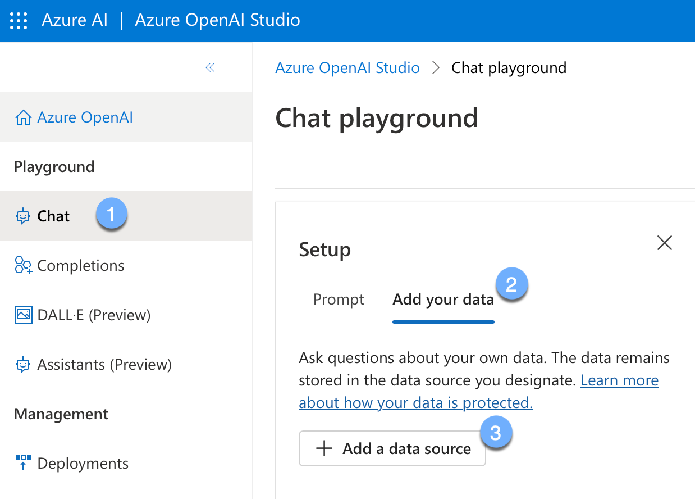
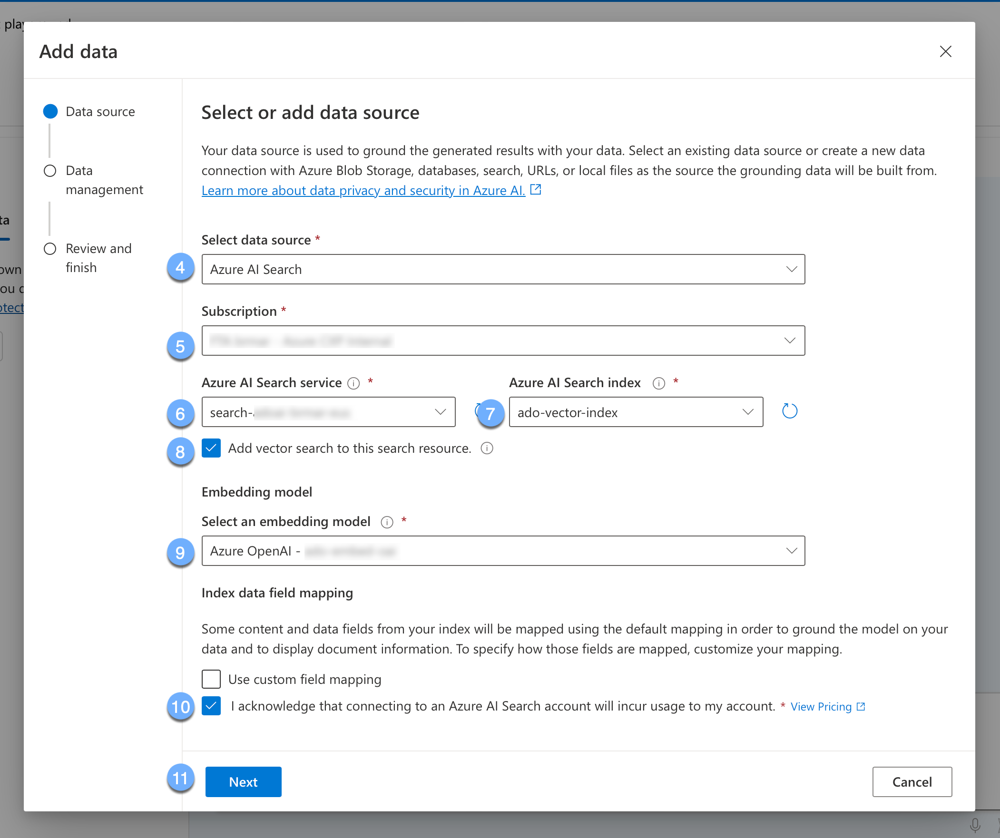
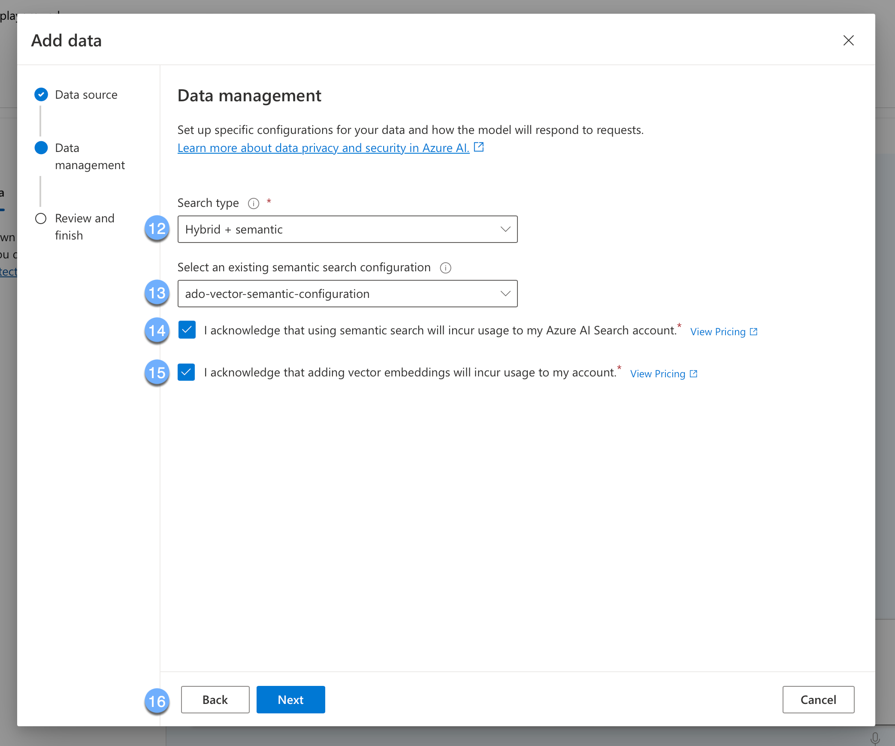
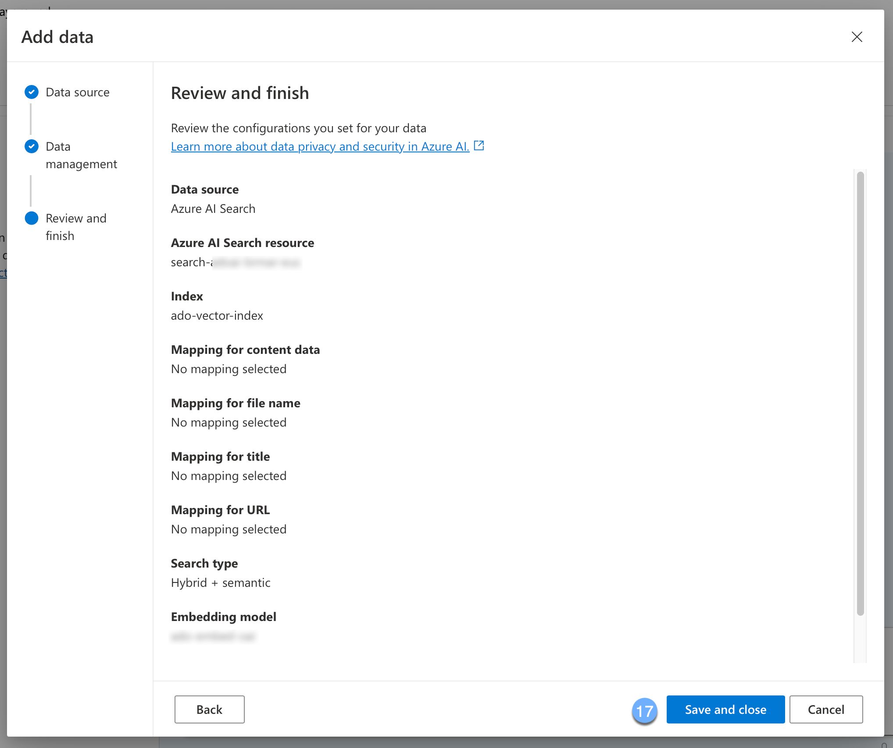
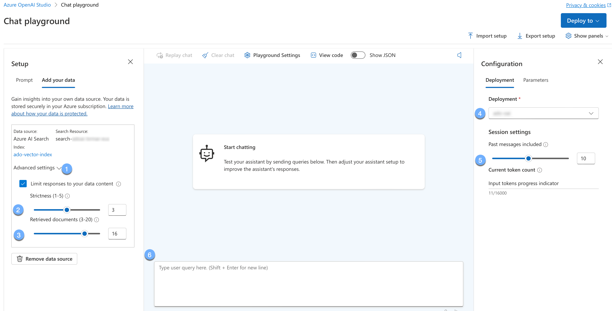
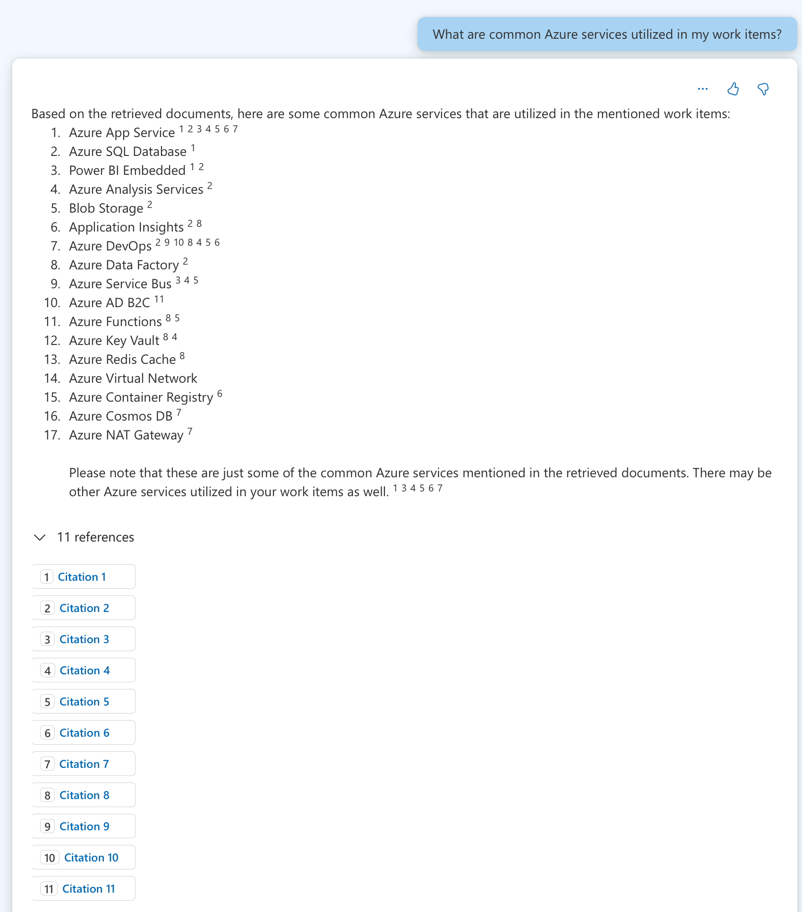

# ADO ChatGPT

A ChatGPT-like experience to query over work item data within an Azure DevOps
organization.

## Pre-requisites

To run this sample in its entirety, you need the following:

- a bash-like shell (e.g. Git Bash, WSL, etc.)
- an Azure DevOps organization and team project from which data will be exported
- an Azure DevOps
  [work item query](https://learn.microsoft.com/en-us/azure/devops/boards/queries/using-queries?view=azure-devops&tabs=browser)
  to pull work items from (should return 1000 items or less)
- an Azure subscription, with access to [Open AI](https://aka.ms/oai/access)
- az cli installed and logged in to your Azure subscription

## Configuration

Duplicate the `.envsample` file and rename it to `.env`. Fill in the values for
all of the required environment variables.

<details>

<summary>The following parameters can be configured:</summary>

| Name                               | Description                                                                                                                                                                                                                                                                                                                                                                                                                                                                                                                                                                                                                                       | Required? |
| ---------------------------------- | ------------------------------------------------------------------------------------------------------------------------------------------------------------------------------------------------------------------------------------------------------------------------------------------------------------------------------------------------------------------------------------------------------------------------------------------------------------------------------------------------------------------------------------------------------------------------------------------------------------------------------------------------- | --------- |
| AZURE_LOCATION                     | The name of the Azure region to deploy to; a list can be found by running `az account list-locations -o table --query "[].displayName"`                                                                                                                                                                                                                                                                                                                                                                                                                                                                                                           | Yes       |
| AZURE_WORKLOAD                     | The workload name to be used when creating Azure resources; keep short and limited to A-z, 0-9, and hyphens                                                                                                                                                                                                                                                                                                                                                                                                                                                                                                                                       | Yes       |
| AZURE_SUBSCRIPTIONID               | The Subscription ID (GUID) that this sample will be deployed to                                                                                                                                                                                                                                                                                                                                                                                                                                                                                                                                                                                   | Yes       |
| ADO_ORG                            | The Azure DevOps organization name work items will be exported from                                                                                                                                                                                                                                                                                                                                                                                                                                                                                                                                                                               | Yes       |
| ADO_PROJECT                        | The Azure DevOps project name work items will be exported from                                                                                                                                                                                                                                                                                                                                                                                                                                                                                                                                                                                    | Yes       |
| ADO_QUERIES                        | A comma-separated list of query IDs that work items will be pulled from                                                                                                                                                                                                                                                                                                                                                                                                                                                                                                                                                                           | Yes       |
| ADO_RECORDFORMAT                   | A [JMESPath query](https://jmespath.org) to flatten the ADO [work item JSON](https://learn.microsoft.com/en-us/rest/api/azure/devops/wit/work-items/get-work-item?view=azure-devops-rest-7.1&tabs=HTTP); defaults to: `{Id:id,AreaPath:fields."System.AreaPath",AssignedTo:fields."System.AssignedTo".displayName,State:fields."System.State",CreatedDate:fields."System.CreatedDate",ChangedDate:fields."System.ChangedDate",Title:fields."System.Title",StateChangeDate:fields."Microsoft.VSTS.Common.StateChangeDate",ClosedDate:fields."Microsoft.VSTS.Common.ClosedDate",Description:fields."System.Description",Tags:fields."System.Tags"}` | Yes       |
| AZURE_OPENAI_EMBEDDINGMODELNAME    | The name of the [Azure OpenAI Model](https://learn.microsoft.com/en-us/azure/ai-services/openai/concepts/models#model-summary-table-and-region-availability) to use for embedding vectors into the Azure AI Search index (recommended to use `text-embedding-ada-002` or equivalent)                                                                                                                                                                                                                                                                                                                                                              | Yes       |
| AZURE_OPENAI_EMBEDDINGMODELVERSION | The version of the [Azure OpenAI Model](https://learn.microsoft.com/en-us/azure/ai-services/openai/concepts/models#model-summary-table-and-region-availability) to use for embedding vectors into the Azure AI Search index (recommended to use `2` or equivalent)                                                                                                                                                                                                                                                                                                                                                                                | Yes       |
| AZURE_OPENAI_MODELNAME             | The name of the [Azure OpenAI Model](https://learn.microsoft.com/en-us/azure/ai-services/openai/concepts/models#model-summary-table-and-region-availability) to use for querying the Azure AI Search index (recommended to use `gpt-35-turbo-16k` or equivalent)                                                                                                                                                                                                                                                                                                                                                                                  | Yes       |
| AZURE_OPENAI_MODELVERSION          | The version of the [Azure OpenAI Model](https://learn.microsoft.com/en-us/azure/ai-services/openai/concepts/models#model-summary-table-and-region-availability) to use for querying the Azure AI Search index (recommended to use `0613` or equivalent)                                                                                                                                                                                                                                                                                                                                                                                           | No        |
| SKIP_ADO_DOWNLOAD                  | Set to `1` to skip the ADO Work Item download process                                                                                                                                                                                                                                                                                                                                                                                                                                                                                                                                                                                             | No        |
| SKIP_ADO_UPLOAD                    | Set to `1` to skip the ADO Work Item upload to Azure Storage process                                                                                                                                                                                                                                                                                                                                                                                                                                                                                                                                                                              | No        |
| SKIP_INFRASTRUCTURE                | Set to `1` to skip the Azure infrastructure deployment process                                                                                                                                                                                                                                                                                                                                                                                                                                                                                                                                                                                    | No        |
| SKIP_OPENAI_MODELSETUP             | Set to `1` to skip the Azure Open AI model setup process                                                                                                                                                                                                                                                                                                                                                                                                                                                                                                                                                                                          | No        |
| SKIP_SEARCH_DATASOURCESETUP        | Set to `1` to skip the Azure AI Search data source setup process                                                                                                                                                                                                                                                                                                                                                                                                                                                                                                                                                                                  | No        |
| SKIP_SEARCH_INDEXERSETUP           | Set to `1` to skip the Azure AI Search indexer setup process                                                                                                                                                                                                                                                                                                                                                                                                                                                                                                                                                                                      | No        |
| SKIP_SEARCH_INDEXSETUP             | Set to `1` to skip the Azure AI Search index setup process                                                                                                                                                                                                                                                                                                                                                                                                                                                                                                                                                                                        | No        |
| SKIP_SEARCH_SKILLSETSETUP          | Set to `1` to skip the Azure AI Search skill set setup process                                                                                                                                                                                                                                                                                                                                                                                                                                                                                                                                                                                    | No        |

</details>

## Deploy the Resources

Execute the following commands to deploy the sample:

```bash

deploy.sh

```

## Use Azure OpenAI Studio to Chat with Your Data

### Configure your chat data source

Once the resources are deployed, you can use the
[Azure OpenAI Studio](https://oai.azure.com/portal/) to chat with your newly
deployed model.



1. Navigate to "Chat" under the Playground
2. Under "Setup", choose "Add your data"
3. Click the "Add data source" button



4. Under "Select data source", choose "Azure AI Search";
5. Choose your Azure subscription
6. Choose your Azure AI Search service
7. For "Azure AI Search index", select `ado-vector-index`
8. Check "Add vector search to this search resource"
9. Choose the embedding model (e.g., `text-embedding-ada-002-2`)
10. Check the "I acknowledge that connecting to an Azure AI Search account will
    incur usage to my account."
11. Click the "Next" button



12. Under the "Search type", ensure "Hybrid + semantic" is selected
13. Under "Select an existing semantic search configuration" choose
    `ado-vector-semantic-configuration`.
14. Check "I acknowledge that using semantic search will incur usage to my Azure
    AI Search account
15. Check "I acknowledge that adding vector embeddings will incur usage to my
    account"
16. Click the "Next" button



17. Review the details presented and click the "Save and close" button

### Chat with your data

Now that your data source is configured, modify the chat playground settings to
begin chatting with your data:



1. Choose "Advanced settings" to expand additional options
2. Optionally, adjust the Strictness (hover over the information icon for more
   details)
3. Optionally, adjust the retrieved documents (hover over the information icon
   for more details)
4. Choose your Open AI model deployment (e.g., `gpt-35-turbo-16k-0613`)
5. Optionally, adjust past messages to include (hover over the information icon
   for more details)
6. Enter your first prompt



Note that citations can be expanded and clicked on to show the data source the
response came from. You can continue to query through additional prompts to
refine the data that has been retrieved.

### Optional: Deploy a Web App

If you would like to deploy a web app to interact with your data, you can use
the "Deploy to…" button and choose "A new web app…" to create an interactive web
application using your newly deployed models and datasets.

For more information, follow the instructions in
[Tutorial: Deploy a web app for chat on your data](https://learn.microsoft.com/en-us/azure/ai-studio/tutorials/deploy-chat-web-app#deploy-the-web-app)

## References and Additional Resources

- This sample is heavily based off this article:
  [Chat with your Azure DevOps data | Microsoft Tech Communities](https://techcommunity.microsoft.com/t5/fasttrack-for-azure/chat-with-your-azure-devops-data/ba-p/4017784)
- Which itself is based off this sample:
  [Preview - Sample Chat App with AOAI | GitHub](https://github.com/microsoft/sample-app-aoai-chatGPT)
